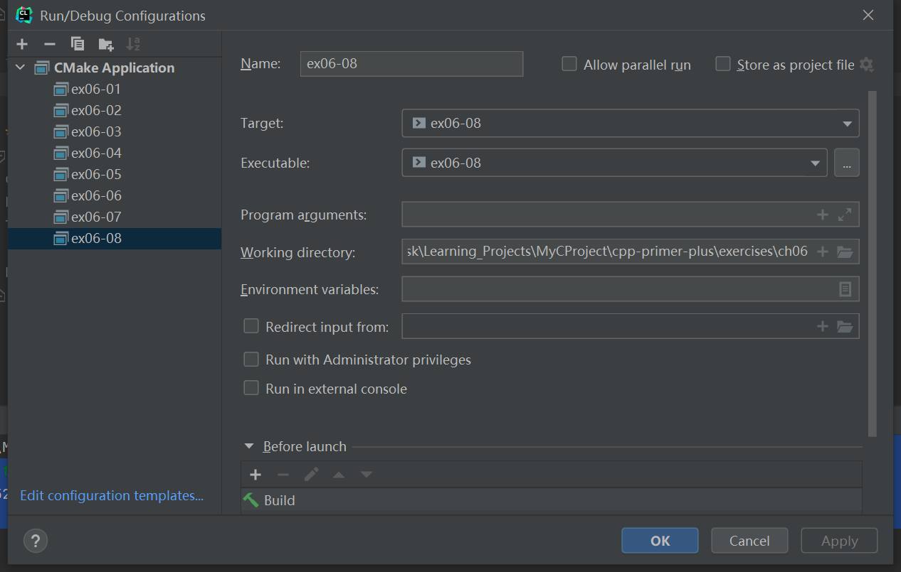

# 习题6.8

&emsp;&emsp;编写一个程序，它打开一个文本文件，逐个字符地读取该文件，直到到达文件末尾，然后指出该文件中包含多少个字符。

**解答：**  
代码位置：`exercises/ch06/ex08.cpp`
```c++
#include "iostream"
#include "fstream"

using namespace std;

int main() {
    string file_name;
    ifstream inFile;
    // input files/text.txt
    cout << "Enter the name of the file:";
    getline(cin, file_name);
    inFile.open(file_name);

    if (!inFile.is_open()) {
        cout << "Could not open the file " << file_name << endl;
        cout << "Program terminating.\n";
        exit(EXIT_FAILURE);
    }

    char ch;
    int char_cnt = 0;
    while (!inFile.eof()) {
        inFile >> ch;
        char_cnt++;
    }

    if (char_cnt == 0) {
        cout << "No content processed.\n";
    } else {
        cout << "The file " << file_name << " contains " << char_cnt << " characters.\n";
    }

    inFile.close();
    return 0;
}
```

该程序需要配置工作目录，用于读取文件相对路径（`exercises/ch06`），具体配置信息见下图：


**执行结果：**  
```
cpp-primer-plus\cmake-build-debug-mingw\ex06-08.exe
Enter the name of the file:files/text.txt
The file files/text.txt contains 52 characters.

Process finished with exit code 0
```