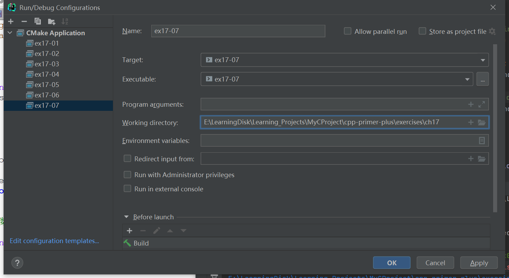

# 习题17.7

&emsp;&emsp;下面是某个程序的部分代码。该程序将键盘输入读取到一个由`string`对象组成的`vector`中，将字符串内容（而不是`string`对象）存储到一个文件中，然后该文件的内容复制到另一个由`string`对象组成的`vector`中。
```c++
int main() {
    using namespace std;
    vector <string> vostr;
    string temp;

    // acquire strings
    cout << "Enter strings (empty line to quit):\n";
    while (getline(cin, temp) && temp[0] != '\0')
        vostr.push_back(temp);
    cout << "Here is your input.\n";
    for_each(vostr.begin(), vostr.end(), ShowStr);
    // store in a file
    ofstream fout("strings.dat", ios_base::out | ios_base::binary);
    for_each(vostr.begin(), vostr.end(), Store(fout));
    fout.close();

    // recover file contents
    vector <string> vistr;
    ifstream fin("strings.dat", ios_base::in | ios_base::binary);
    if (!fin.is_open()) {
        cerr << "Could not open file for input.\n";
        exit(EXIT_FAILURE);
    }
    GetStrs(fin, vistr);
    cout << "\nHere are the strings read from the file:\n";
    for_each(vistr.begin(), vistr.end(), ShowStr);

    return 0;
}
```
&emsp;&emsp;该程序以二进制格式打开文件，并想使用`read()`和`write()`来完成I/O。余下的工作如下所述。
- 编写函数`void ShowStr(const string &)`，它显示一个`string`对象，并在显示完后换行。
- 编写函数符`Store`，它将字符串信息写入到文件中。`Store`的构造函数应接受一个指定`ifstream`对象的参数，而重载的`operator()(const string &)`应指出要写入到文件中的字符串。一种可行的计划是，首先将字符串的长度写入到文件中，然后将字符串的内容写入到文件中。例如，如果`len`存储了字符串的长度，可以这样做：
```c++
os.write((char *)&len, sizeof(std::size_t)); // store length
os.write(s.data(), len);                     // store characters
```
&emsp;&emsp;成员函数`data()`返回一个指针，该指针指向一个其中存储了字符串中字符的数组。它类似于成员函数`c_str()`，只是后者在数组末尾加上了一个空字符。
- 编写函数`GetStrs()`，它根据文件恢复信息。该函数可以使用`read()`来获得字符串得长度，然后使用一个循环从文件中读取相应数量的字符，并将它们附加到一个原来为空的临时`string`末尾。由于`string`的数据是私有的，因此必须使用`string`类的方法来将数据存储到`string`对象中，而不能直接存储。

**解答：**  
代码位置：`exercises/ch17/ex07.cpp`

```c++
#include <iostream>
#include <vector>
#include <fstream>
#include <algorithm>

using namespace std;

void ShowStr(const string &str);

void GetStrs(ifstream &fin, vector<string> &v);

class Store {
private:
    string str;
    ofstream *fout;
public:
    Store(ofstream &out) : fout(&out) {}

    bool operator()(const string &str);

    ~Store() {}
};

bool Store::operator()(const string &str) {
    unsigned int len = str.length();
    if (fout->is_open()) {
        fout->write((char *) &len, sizeof len);
        fout->write(str.data(), len);
        return true;
    } else {
        return false;
    }
}

// input
// It was a dark and stormy day, and
// the full moon glowed brilliantly.
int main() {
    using namespace std;
    vector<string> vostr;
    string temp;

    // acquire strings
    cout << "Enter strings (empty line to quit):\n";
    while (getline(cin, temp) && temp[0] != '\0')
        vostr.push_back(temp);
    cout << "Here is your input.\n";
    for_each(vostr.begin(), vostr.end(), ShowStr);
    // store in a file
    ofstream fout("files/strings.dat", ios_base::out | ios_base::binary);
    for_each(vostr.begin(), vostr.end(), Store(fout));
    fout.close();

    // recover file contents
    vector<string> vistr;
    ifstream fin("files/strings.dat", ios_base::in | ios_base::binary);
    if (!fin.is_open()) {
        cerr << "Could not open file for input.\n";
        exit(EXIT_FAILURE);
    }
    GetStrs(fin, vistr);
    cout << "\nHere are the strings read from the file:\n";
    for_each(vistr.begin(), vistr.end(), ShowStr);

    return 0;
}

void ShowStr(const string &str) {
    cout << str << endl;
}

void GetStrs(ifstream &fin, vector<string> &v) {
    unsigned int len;
    char *p;
    while (fin.read((char *) &len, sizeof len)) {
        p = new char[len];
        fin.read(p, len);
        v.push_back(p);
    }
}
```

该程序需要配置工作目录，用于读取文件相对路径，具体配置信息见下图：


**执行结果：**  
```
cpp-primer-plus\cmake-build-debug\ex17-07.exe
Enter strings (empty line to quit):
It was a dark and stormy day, and
the full moon glowed brilliantly.

Here is your input.
It was a dark and stormy day, and
the full moon glowed brilliantly.

Here are the strings read from the file:
It was a dark and stormy day, and
the full moon glowed brilliantly.

Process finished with exit code 0
```